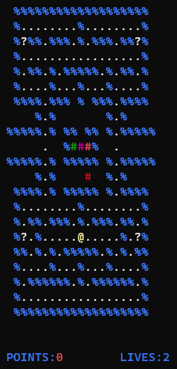

# Pac-Man
This is an attempt to recreate the iconic arcade game Pac-Man using OOP concepts. The aim of the game is to gather as many points as possible with 3 lives. Points can be earned by clearing the map or going after the ghosts but be careful, ghosts can be eliminated only when you have taken a power-up. 

## Setting Up
- Clone the repo by using `git clone https://github.com/kid-116/Pac-Man.git` into your chosen directory
- Launch `src\pacman.exe`
- Enjoy
## Controls
- Use `wasd` to move around the map
